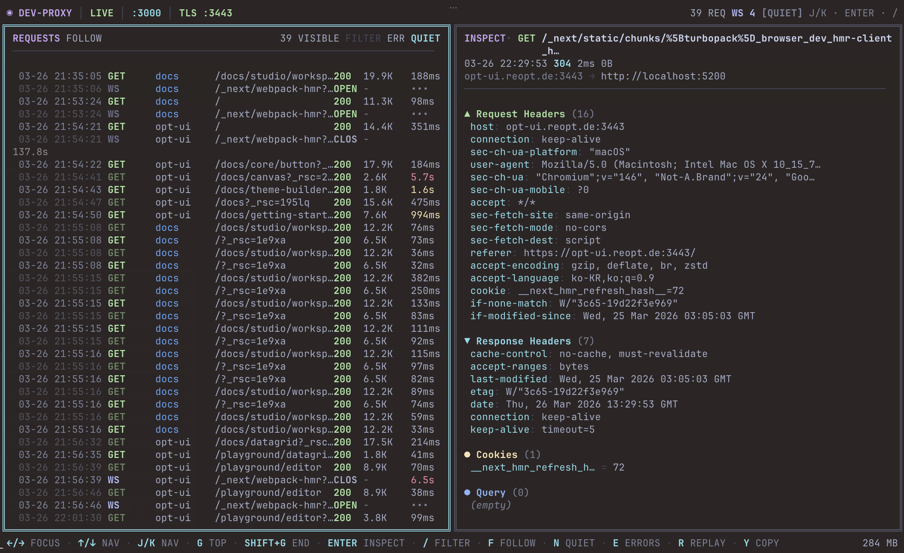

# dev-proxy

[](https://www.npmjs.com/package/@reopt-ai/dev-proxy)
[](https://github.com/reopt-ai/dev-proxy/actions/workflows/ci.yml)
[](LICENSE)
[](https://nodejs.org)

**Subdomain-based reverse proxy with a real-time HTTP/WS traffic inspector TUI.**

Built for agentic development workflows where dozens of services, worktrees, and AI-driven coding sessions run simultaneously — one proxy to route them all, one terminal to see everything.

Routes `*.{domain}:3000` requests to local services by subdomain and displays all traffic in a terminal dashboard. Think of it as a lightweight, terminal-native alternative to tools like Charles or Proxyman — purpose-built for local multi-service development.

[한국어 문서 (Korean)](README_KO.md)



## Why dev-proxy?

When developing with multiple local services (frontend, API, auth, docs, admin...), you need a way to route requests by subdomain and see what's happening. Existing options are either too heavy (nginx, Caddy) or GUI-only (Charles, Proxyman).

dev-proxy is:

- **Zero-config start** — Works out of the box with `localhost` and auto-generated TLS certs
- **Terminal-native** — No browser windows to manage; lives where you already work
- **Vim-style navigation** — `j`/`k` to browse, `/` to search, `r` to replay
- **Worktree-aware** — Routes `branch--app.domain` to per-worktree ports automatically
- **Lightweight** — Two runtime dependencies (`ink` + `react`), ~10fps throttled rendering

## Features

- Real-time HTTP request/response monitoring (method, status, size, latency)
- WebSocket connection tracking (OPEN / CLOSED / ERROR)
- Request/response header, cookie, and query parameter inspection
- Noise filter (`_next/`, `favicon`), error-only mode, URL/method search
- Request replay with original headers and curl copy to clipboard
- Upstream `http`/`https` and `ws`/`wss` target support
- Git worktree-based dynamic routing via project config
- Auto-generated TLS certificates via [mkcert](https://github.com/FiloSottile/mkcert)
- Project-based config: global (`~/.dev-proxy/config.json`) + per-project (`.dev-proxy.json`)

## Prerequisites

- **Node.js** >= 20.11
- **mkcert** _(optional, for HTTPS)_ — `brew install mkcert && mkcert -install`

## Quick Start

### For Humans

```bash
npm install -g @reopt-ai/dev-proxy
dev-proxy init
dev-proxy
```

Press **Enter** to arm the inspector, then open `http://www.example.dev:3000` in your browser.

### For LLM Agents

Paste this to your AI coding agent (Claude Code, Cursor, Copilot, etc.):

> Install and configure dev-proxy by following the instructions here:
> https://raw.githubusercontent.com/reopt-ai/dev-proxy/main/docs/guide/installation.md

## Install

```bash
# npx (no install)
npx @reopt-ai/dev-proxy

# Global install
npm install -g @reopt-ai/dev-proxy

# From source
git clone https://github.com/reopt-ai/dev-proxy.git
cd dev-proxy && pnpm install && pnpm proxy
```

## Configuration

Config is split into two layers:

1. **`~/.dev-proxy/config.json`** — Global settings (domain, ports, TLS, project list)
2. **`.dev-proxy.json`** — Per-project config (routes, worktrees)

### Global Config (`~/.dev-proxy/config.json`)

```json
{
  "domain": "example.dev",
  "port": 3000,
  "httpsPort": 3443,
  "projects": ["/path/to/your/project"]
}
```

### Project Config (`.dev-proxy.json`)

Place a `.dev-proxy.json` in each project root registered in `projects`. Routes and worktrees are defined here.

```json
{
  "routes": {
    "www": "http://localhost:3001",
    "studio": "http://localhost:3001",
    "api": "http://localhost:4000",
    "*": "http://localhost:3001"
  },
  "worktrees": {
    "feature-auth": { "port": 4001 }
  }
}
```

- `"*"` is a wildcard — unmatched subdomains route here
- When multiple projects register the same subdomain, the first one wins
- `certPath`/`keyPath` are set in the global config, resolved relative to `~/.dev-proxy/`

### HTTPS

Certificates are stored in `~/.dev-proxy/certs/`. If missing, they are auto-generated using [mkcert](https://github.com/FiloSottile/mkcert).

```bash
brew install mkcert
mkcert -install
```

When mkcert is installed, dev-proxy automatically generates wildcard certificates on first run. No manual steps needed.

### Worktree Routing

dev-proxy supports git worktree-based dynamic routing. When you use `branch--app.domain` as the hostname, it routes to a per-worktree port.

**Automatic lifecycle management:**

Add `worktreeConfig` to your project's `.dev-proxy.json`. Use `services` to define per-subdomain port mappings — dev-proxy allocates ports automatically and generates a `.env.local` file so your dev servers know which port to listen on:

```json
{
  "routes": {
    "www": "http://localhost:3001",
    "data": "http://localhost:4001",
    "*": "http://localhost:3001"
  },
  "worktrees": {
    "main": { "ports": { "www": 3001, "data": 4001 } }
  },
  "worktreeConfig": {
    "portRange": [4101, 5000],
    "directory": "../myproject-{branch}",
    "services": {
      "www": { "env": "PORT" },
      "data": { "env": "DATA_PORT" }
    },
    "envFile": ".env.local",
    "hooks": {
      "post-create": "pnpm install",
      "post-remove": "echo cleanup done"
    }
  }
}
```

Then create and destroy worktrees with a single command:

```bash
dev-proxy worktree create feature-auth
# → git worktree add
# → allocates ports: www=4101, data=4102
# → writes .env.local: PORT=4101, DATA_PORT=4102
# → runs post-create hook (pnpm install)

dev-proxy worktree destroy feature-auth
# → runs post-remove hook, git worktree remove, releases ports
```

**How routing works:**

- `feature-auth--www.example.dev:3000` → routes to port 4101 (www service)
- `feature-auth--data.example.dev:3000` → routes to port 4102 (data service)
- Config file is watched live — routing updates instantly on changes
- Unregistered worktrees show an offline error page instead of silently falling back

**Manual mode** (without `worktreeConfig`):

```bash
dev-proxy worktree add feature-auth 4001    # Register single port (no git operations)
dev-proxy worktree remove feature-auth      # Unregister only
```

## Usage

```bash
# If installed globally or via npx
dev-proxy

# From source
pnpm proxy

# Debug mode (tsx, no build step)
pnpm proxy:src
```

`pnpm proxy` builds `dist/` first, then runs with `NODE_ENV=production` to avoid Ink/React dev-mode memory leaks.

### UI States

The TUI has three states:

1. **Splash** — Shows configured routes and listening ports. Press **Enter** to arm.
2. **Inspect** — Live traffic dashboard with list + detail panels.
3. **Standby** — Auto-sleeps after 60s of no interaction to reduce memory pressure. Press **I** or **Enter** to resume.

## Keybindings

### Navigation

| Key       | Action                      |
| --------- | --------------------------- |
| `←` / `→` | Switch list / detail focus  |
| `j` / `↓` | Next request                |
| `k` / `↑` | Previous request            |
| `g`       | Jump to first               |
| `G`       | Jump to last                |
| `Enter`   | Open detail panel           |
| `Esc`     | Back to list / clear search |

### Detail Panel

| Key       | Action |
| --------- | ------ |
| `↑` / `↓` | Scroll |

> Focusing the detail panel automatically disables Follow mode so your selection stays put.

### Filters & Actions

| Key | Action                                     |
| --- | ------------------------------------------ |
| `/` | Search mode (filter by URL or method)      |
| `f` | Toggle Follow mode                         |
| `n` | Toggle noise filter (`_next`, `favicon`)   |
| `e` | Toggle error-only mode                     |
| `x` | Clear all traffic and filters              |
| `r` | Replay selected request (with headers)     |
| `y` | Copy selected request as curl to clipboard |

### Mouse

- **Scroll** in list or detail panel
- **Click** a row to select it
- **Click** header filter badges to toggle them

## Security

This is a **development tool** and makes deliberate trade-offs for local development convenience:

- **`rejectUnauthorized: false`** — The proxy accepts self-signed certificates from upstream targets. This is intentional so that dev services using mkcert or self-signed certs work without extra configuration. **Do not use this proxy in production.**
- **No authentication** — The proxy binds to localhost by default with no auth layer.

## Troubleshooting

### Port already in use

```
Error: port 3000 is already in use (another dev-proxy instance may already be running)
```

Kill the existing process or use a different port in your config:

```bash
# Find and kill
lsof -ti :3000 | xargs kill

# Or change port
# Or change port in ~/.dev-proxy/config.json: "port": 3080
```

### mkcert not found

```
HTTPS disabled — mkcert not found.
```

HTTPS is optional. Install mkcert for TLS support:

```bash
brew install mkcert    # macOS
mkcert -install
```

### Blank screen / Raw mode error

If you see `Raw mode is not supported`, you're running in a non-TTY context (e.g., piped output, CI). dev-proxy requires an interactive terminal.

### Request not routing to expected target

1. Check the splash screen — it lists all configured routes
2. Verify your `Host` header matches `subdomain.domain:port`
3. Ensure the target service is actually running on the configured port

## CLI Reference

| Command                                | Description                                      |
| -------------------------------------- | ------------------------------------------------ |
| `dev-proxy`                            | Start proxy and open traffic inspector           |
| `dev-proxy init`                       | Interactive setup wizard                         |
| `dev-proxy status`                     | Show configuration and routing table             |
| `dev-proxy doctor`                     | Run environment diagnostics                      |
| `dev-proxy config`                     | View global settings                             |
| `dev-proxy config set <key> <value>`   | Modify global settings (domain, port, httpsPort) |
| `dev-proxy project add [path]`         | Register a project (default: cwd)                |
| `dev-proxy project remove <path>`      | Unregister a project                             |
| `dev-proxy project list`               | List registered projects                         |
| `dev-proxy worktree create <branch>`   | Create worktree with auto port + hooks           |
| `dev-proxy worktree destroy <branch>`  | Destroy worktree with hooks + cleanup            |
| `dev-proxy worktree add <name> <port>` | Register worktree manually (no git operations)   |
| `dev-proxy worktree remove <name>`     | Unregister worktree manually                     |
| `dev-proxy worktree list`              | List all worktrees                               |
| `dev-proxy --help`                     | Show help                                        |
| `dev-proxy --version`                  | Show version                                     |

## Architecture

```
src/
├── cli.ts                 # Subcommand router
├── index.tsx              # TUI dashboard (Ink render + proxy lifecycle)
├── store.ts               # External store (useSyncExternalStore)
├── commands/              # CLI subcommands (Ink components)
│   ├── init.tsx           # Interactive setup wizard
│   ├── status.tsx         # Configuration overview
│   ├── doctor.tsx         # Environment diagnostics
│   ├── config.tsx         # Config view/set
│   ├── project.tsx        # Project management
│   ├── worktree.tsx       # Worktree management
│   ├── help.tsx           # Help output
│   └── version.tsx        # Version output
├── cli/                   # Shared CLI components
│   ├── output.tsx         # Display components (Header, Section, Check, etc.)
│   └── prompt.tsx         # Input components (TextPrompt, Confirm)
├── proxy/
│   ├── config.ts          # Config loader (~/.dev-proxy + .dev-proxy.json)
│   ├── server.ts          # HTTP/WS reverse proxy
│   ├── routes.ts          # Subdomain → target routing
│   ├── certs.ts           # TLS certificate resolution (mkcert)
│   ├── worktrees.ts       # Dynamic worktree port registry
│   └── types.ts           # Event types
├── components/
│   ├── app.tsx             # Root (resize, keyboard, state machine)
│   ├── splash.tsx          # Splash screen
│   ├── status-bar.tsx      # Top status bar
│   ├── request-list.tsx    # Request list (viewport slicing)
│   ├── detail-panel.tsx    # Detail panel (scrollable)
│   └── footer-bar.tsx      # Bottom keybinding hints
├── hooks/
│   └── use-mouse.ts        # SGR mouse event parser
└── utils/
    ├── format.ts           # Color palette, formatters
    └── list-layout.ts      # Responsive column layout
```

## Contributing

See [CONTRIBUTING.md](CONTRIBUTING.md) for development setup and guidelines.

## License

[MIT](LICENSE)
