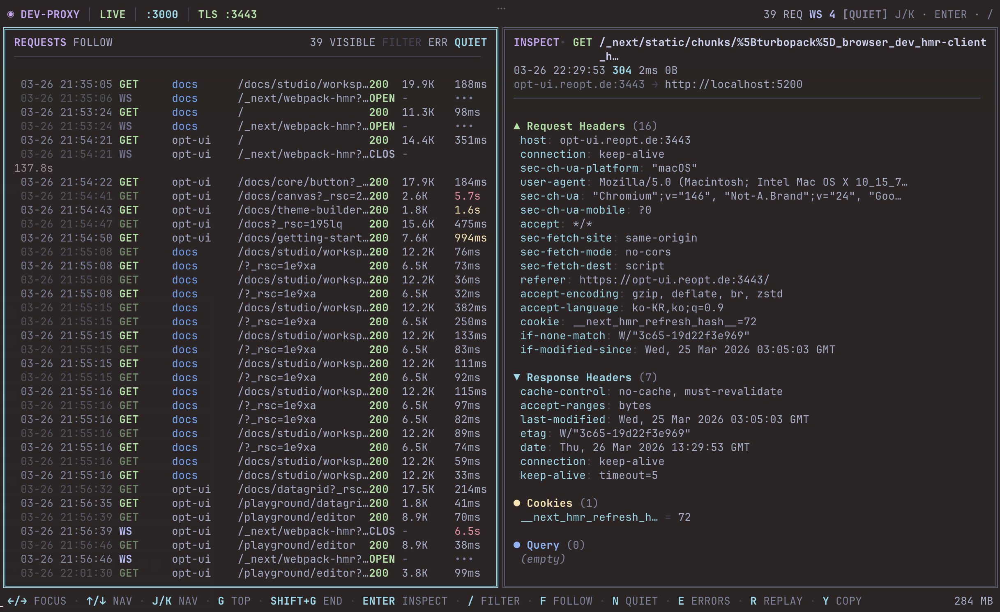

# dev-proxy

[](https://www.npmjs.com/package/@reopt-ai/dev-proxy)
[](https://github.com/reopt-ai/dev-proxy/actions/workflows/ci.yml)
[](https://codecov.io/gh/reopt-ai/dev-proxy)
[](LICENSE)
[](https://nodejs.org)
[](https://www.npmjs.com/package/@reopt-ai/dev-proxy)
[](https://www.typescriptlang.org/)
[](CONTRIBUTING.md)
[](https://scorecard.dev/viewer/?uri=github.com/reopt-ai/dev-proxy)
[](https://www.bestpractices.dev/projects/12292)

**서브도메인 기반 리버스 프록시 + 실시간 HTTP/WS 트래픽 인스펙터 TUI.**

수십 개의 서비스, 워크트리, AI 에이전트 코딩 세션이 동시에 돌아가는 에이전틱 개발 환경을 위해 만들었습니다 — 하나의 프록시로 전부 라우팅하고, 하나의 터미널로 전부 봅니다.

`*.{domain}:3000`으로 들어오는 요청을 서브도메인별로 로컬 서비스에 라우팅하고, 모든 트래픽을 터미널 대시보드로 실시간 모니터링합니다. Charles나 Proxyman의 가벼운 터미널 버전이라고 생각하면 됩니다 — 로컬 멀티서비스 개발에 특화되어 있습니다.

[English Documentation](README.md)



## 왜 dev-proxy인가?

프론트엔드, API, 인증, 문서, 어드민 등 여러 로컬 서비스를 동시에 개발할 때 서브도메인 라우팅과 트래픽 모니터링이 필요합니다. 기존 도구들은 너무 무겁거나(nginx, Caddy) GUI 전용(Charles, Proxyman)입니다.

dev-proxy는:

- **제로 설정 시작** — `localhost` 기본값과 TLS 인증서 자동 생성으로 바로 실행
- **터미널 네이티브** — 브라우저 창 없이 터미널에서 바로 확인
- **Vim 스타일 네비게이션** — `j`/`k`로 탐색, `/`로 검색, `r`로 재전송
- **Worktree 지원** — `branch--app.domain` 형태로 워크트리별 포트 자동 라우팅
- **경량** — 런타임 의존성 2개(`ink` + `react`), ~10fps 스로틀 렌더링

## 주요 기능

- HTTP 요청/응답 실시간 모니터링 (메서드, 상태, 크기, 지연시간)
- WebSocket 연결 추적 (OPEN / CLOSED / ERROR)
- Request/Response 헤더, 쿠키, 쿼리 파라미터 인스펙션
- 노이즈 필터 (`_next/`, `favicon`), 에러 전용 모드, URL/메서드 검색
- 원본 헤더 포함 요청 재전송 및 curl 클립보드 복사
- 업스트림 `http`/`https`, `ws`/`wss` 타깃 지원
- 프로젝트 설정 기반 Git worktree 동적 라우팅
- [mkcert](https://github.com/FiloSottile/mkcert)를 이용한 TLS 인증서 자동 생성
- 프로젝트 기반 설정: 전역 (`~/.dev-proxy/config.json`) + 프로젝트별 (`dev-proxy.config.mjs`에 라우트 + `worktreeConfig`, `.dev-proxy.worktrees.json`에 CLI가 관리하는 워크트리 맵). 레거시 `.dev-proxy.json`은 fallback으로만 읽힙니다.

## 요구 사항

- **Node.js** >= 20.11
- **mkcert** _(선택, HTTPS용)_ — `brew install mkcert && mkcert -install`

## 빠른 시작

### 사람용

```bash
npm install -g @reopt-ai/dev-proxy
dev-proxy init
dev-proxy
```

**Enter**를 눌러 인스펙터를 활성화한 뒤, 브라우저에서 `http://www.example.dev:3000`을 열어보세요.

### AI 에이전트용

**방법 1 — Claude Code 스킬** (권장):

```bash
npx skills add reopt-ai/dev-proxy
```

Claude Code에서 **"setup dev-proxy"** 라고 입력하면 프로젝트 구조를 자동 분석하고, 라우트를 제안하고, 설정 파일을 생성합니다.

**방법 2 — 모든 AI 에이전트**:

AI 코딩 에이전트(Claude Code, Cursor, Copilot 등)에 이 프롬프트를 붙여넣으세요:

> Install and configure dev-proxy by following the instructions here:
> https://raw.githubusercontent.com/reopt-ai/dev-proxy/main/docs/guide/installation.md

## 설치

```bash
# npx (설치 없이)
npx @reopt-ai/dev-proxy

# 전역 설치
npm install -g @reopt-ai/dev-proxy

# 소스에서 실행
git clone https://github.com/reopt-ai/dev-proxy.git
cd dev-proxy && pnpm install && pnpm proxy
```

## 설정

신규 설정에서는 세 개의 파일을 씁니다:

1. **`~/.dev-proxy/config.json`** — 전역 설정 (도메인, 포트, TLS, 프로젝트 목록)
2. **`<프로젝트>/dev-proxy.config.mjs`** — 프로젝트별 라우트 + (선택) `worktreeConfig`. 사람이 직접 편집합니다.
3. **`<프로젝트>/.dev-proxy.worktrees.json`** — CLI가 관리하는 워크트리 인스턴스 맵 (`dev-proxy init`이 빈 `{ "worktrees": {} }` placeholder를 만들고 워크트리 CLI 명령이 자동 갱신 — 직접 편집하지 마세요)

> 가장 간단한 방법은 프로젝트 디렉터리에서 `dev-proxy init`을 실행하는 것입니다. 마법사가 위 파일들을 자동으로 생성합니다. 아래 섹션은 직접 작성하고 싶을 때 참고하세요.

> **레거시 `<프로젝트>/.dev-proxy.json`**은 옛 레이아웃(pre-mjs) 프로젝트를 위해 읽기 전용 fallback으로만 동작합니다. `dev-proxy migrate`를 한 번 실행하면 사라집니다.

### 전역 설정 (`~/.dev-proxy/config.json`)

```json
{
  "domain": "example.dev",
  "port": 3000,
  "httpsPort": 3443,
  "projects": ["/path/to/your/project"]
}
```

선택 항목:

- `certPath` / `keyPath` — mkcert 기본값 대신 직접 발급한 인증서를 씁니다(상대 경로는 `~/.dev-proxy/` 기준). [다른 기기에서 접근하기](#다른-기기에서-접근하기) 참고.

### 프로젝트 라우트 (`dev-proxy.config.mjs`)

`projects`에 등록된 각 프로젝트 루트에 `dev-proxy.config.mjs`를 배치합니다. 라우트는 여기에 정의합니다.

```js
/** @type {import('@reopt-ai/dev-proxy').Config} */
export default {
  routes: {
    "@": "http://localhost:3005",
    www: "http://localhost:3001",
    studio: "http://localhost:3001",
    api: "http://localhost:4000",
    "*": "http://localhost:3001",
  },
};
```

- `"@"`는 **apex(bare) 도메인** — 서브도메인 없는 도메인 자체(예: `example.dev`)를 가리킵니다. 선택사항이며, 없으면 `"*"`로 fallback.
- `"*"`는 와일드카드 — 매칭되지 않는 서브도메인이 이 타깃으로 라우팅됩니다
- 여러 프로젝트가 같은 서브도메인을 등록하면 먼저 등록된 것이 우선
- `certPath`/`keyPath`는 전역 설정에서 지정하며, `~/.dev-proxy/` 기준 상대 경로로 해석됩니다
- `dev-proxy.config.js`도 지원됩니다 (`package.json`에 `"type": "module"`이 있을 때 사용). 둘 다 있으면 `.mjs`가 우선합니다
- 런타임 해석 순서: `dev-proxy.config.mjs` → `dev-proxy.config.js` → `.dev-proxy.json` (`routes`와 `worktreeConfig` 양쪽 모두에 대한 레거시 fallback)
- CLI가 관리하는 `worktrees` 인스턴스 맵은 항상 `.dev-proxy.worktrees.json`에 저장됩니다. `worktreeConfig`(있는 경우)는 `dev-proxy.config.mjs`의 같은 default export 안에 `routes`와 나란히 두세요 — [Worktree 라우팅](#worktree-라우팅) 참고.

### `.dev-proxy.json`에서 마이그레이션

이전 버전은 모든 것(routes, `worktreeConfig`, `worktrees` 인스턴스 맵)을 `.dev-proxy.json` 한 파일에 담았습니다. 읽기는 여전히 fallback으로 호환되지만, 신규 설정은 `dev-proxy.config.mjs` (라우트 + `worktreeConfig`) + `.dev-proxy.worktrees.json` (CLI 관리) 조합을 씁니다. 등록된 모든 프로젝트를 한 번에 정리하려면:

```bash
dev-proxy migrate
```

이 명령은 `.dev-proxy.json`의 `routes`와 `worktreeConfig`를 `dev-proxy.config.mjs`로, `worktrees` 인스턴스 맵을 `.dev-proxy.worktrees.json`으로 옮긴 뒤 `.dev-proxy.json`이 비면 파일 자체를 삭제합니다. 멱등하며 이미 마이그레이션된 프로젝트는 건너뜁니다.

### HTTPS

인증서는 `~/.dev-proxy/certs/`에 저장됩니다. 인증서가 없으면 [mkcert](https://github.com/FiloSottile/mkcert)를 사용해 자동 생성합니다.

```bash
brew install mkcert
mkcert -install
```

mkcert가 설치되어 있으면 첫 실행 시 와일드카드 인증서를 자동 생성합니다. 수동 작업 불필요.

### 다른 기기에서 접근하기

프록시는 모든 인터페이스에서 수신하므로, 같은 네트워크의 휴대폰이나 동료 노트북에서 `http://<내-LAN-IP>:3000`으로는 바로 접근할 수 있습니다. 안 되는 것은 `*.example.dev`를 내 컴퓨터로 해석하는 것과 mkcert 인증서를 신뢰하는 것, 두 가지입니다. 아래 중 하나를 고르세요:

|                                     | DNS                                                             | TLS                              | 휴대폰              |
| ----------------------------------- | --------------------------------------------------------------- | -------------------------------- | ------------------- |
| **공개 DNS + Let's Encrypt** (권장) | 소유한 도메인에 와일드카드 `A` 레코드 → 내 LAN IP               | DNS-01 챌린지로 실제 인증서 발급 | 기기 설정 없이 동작 |
| **내 컴퓨터에서 dnsmasq 운영**      | LAN IP에 바인딩한 dnsmasq를 기기(또는 공유기 DHCP)의 DNS로 지정 | 기기마다 mkcert 루트 CA 설치     | CA 설치 후 동작     |
| **기기별 hosts 파일**               | 기기마다 `/etc/hosts` 편집                                      | 기기마다 mkcert 루트 CA 설치     | 불가                |

**공개 DNS + Let's Encrypt**

1. 공유기에서 내 컴퓨터에 고정 LAN IP를 예약합니다(DHCP 예약).
2. `*.dev.example.com`과 `dev.example.com` `A` 레코드를 그 사설 IP로 추가합니다. 일부 공유기는 사설 IP가 담긴 DNS 응답을 차단하므로(rebinding 보호), 다른 기기에서 `nslookup app.dev.example.com`이 실패하면 공유기에서 해당 도메인을 허용하세요.
3. DNS-01 챌린지로 와일드카드 인증서를 발급합니다. 예: `certbot certonly --manual --preferred-challenges dns -d '*.dev.example.com' -d dev.example.com`. 발급된 파일을 `~/.dev-proxy/config.json`의 `certPath` / `keyPath`에 지정합니다.
4. `domain`을 `dev.example.com`으로 바꿉니다.

레코드는 공개되므로 `*.dev.example.com`이 사설 주소를 가리킨다는 사실은 누구나 조회할 수 있습니다. 다만 실제 접근은 같은 네트워크의 기기만 가능합니다.

**갱신.** Let's Encrypt 인증서는 90일짜리입니다. certbot의 `--manual-auth-hook` / `--manual-cleanup-hook`(DNS 제공자의 CLI나 API로 `_acme-challenge` TXT 레코드를 넣고 지우는 스크립트)으로 DNS-01 챌린지를 자동화하고, `certbot renew`를 cron이나 launchd로 돌리세요. dev-proxy는 인증서 파일을 감시해 갱신된 인증서를 재시작 없이 교체합니다 — certbot이 `live/*.pem` 심링크를 바꾸는 경우도 포함합니다.

**서비스 하나를 여러 머신이 공유하기.** 공개 레코드가 한 머신을 가리키므로, 다른 개발자는 기본적으로 그 머신의 서비스를 쓰게 됩니다. 일부 앱을 자기 머신에서 띄우는 개발자는 그 서브도메인만 자기 `/etc/hosts`에서 덮어쓰고(hosts가 DNS보다 우선) 나머지는 그대로 둡니다. 예를 들어 `studio`는 로컬에서 띄우되 `id` 서버는 공유 머신 것을 쓰려면:

```text
127.0.0.1 studio.dev.example.com
# id.dev.example.com 은 적지 않는다 → DNS → 공유 머신
```

호스트 이름이 어디서나 같으므로 쿠키, OAuth 리다이렉트 URI, CORS 허용 목록이 공유/로컬 구성 사이에서 달라지지 않습니다.

**mkcert CA를 공유하는 방법**

`mkcert -CAROOT`가 `rootCA.pem`이 있는 디렉터리를 알려줍니다. 이 파일을 각 기기에 신뢰할 수 있는 루트로 설치하세요(iOS: AirDrop → 프로파일 설치 → 설정 › 일반 › 정보 › 인증서 신뢰 설정, Android: 설정 › 보안 › 인증서 설치). 기존 와일드카드 인증서가 모든 서브도메인을 이미 포함하므로 재발급은 필요 없습니다.

어느 방식이든 `dev-proxy doctor`를 실행해 보세요. **Network** 섹션은 다른 기기가 사용할 주소를, **DNS**는 각 호스트가 루프백(이 컴퓨터만)으로 해석되는지 LAN 주소(네트워크에서 접근 가능)로 해석되는지를, **TLS**는 인증서가 mkcert 발급인지 공개 CA 발급인지를 알려줍니다.

### 피어: 다른 머신에서 서브도메인 서빙하기

공개 DNS가 한 머신(**루트**)을 가리키는 구성에서, 두 번째 머신은 프록시를 띄우지 않고 hosts 파일도 건드리지 않은 채 서브도메인 하나를 넘겨받을 수 있습니다. 루트가 그 서브도메인을 피어의 앱 포트로 전달하고, TLS·인스펙터·호스트 이름은 모두 루트에 그대로 남으므로 쿠키, OAuth 리다이렉트 URI, CORS 허용 목록이 바뀌지 않습니다.

루트에서는 첫 실행 때 `~/.dev-proxy/peer-token`에 토큰이 생성됩니다. 피어에서는:

```bash
dev-proxy peer join 192.168.1.10 --token <토큰>            # 최초 1회
dev-proxy peer run studio --port 3001 -- pnpm dev          # pnpm dev가 도는 동안 studio를 claim
```

`peer run`은 명령이 시작될 때 `studio.<도메인>` → `http://<이 머신의 LAN IP>:3001`을 claim하고, 명령이 끝나면(Ctrl+C 포함) 해제합니다. 앱의 `dev` 스크립트에 넣어 두면 개발자는 평소처럼 `pnpm dev`만 치면 됩니다. 앱은 `localhost`가 아니라 `0.0.0.0`에 바인드해야 합니다. `peer claim` / `peer release`는 명령을 감싸지 않고 같은 일을 하고, `peer list`는 모든 claim을 소유자·도달 가능 여부와 함께 보여줍니다.

규칙: claim은 같은 서브도메인의 루트 로컬 라우트보다 우선합니다. 나중 claim이 이기며 이전 소유자가 표시됩니다. 루트는 30초마다 claim 대상을 프로브하고 10분간 응답이 없으면 claim을 삭제합니다. 컨트롤 API(프록시 포트의 `/_dev-proxy/…`)는 루프백·사설망에서 온 요청에만 응답하며 항상 bearer 토큰이 필요합니다.

### Worktree 라우팅

dev-proxy는 Git worktree 기반 동적 라우팅을 지원합니다. 호스트명에 `branch--app.domain` 형태를 사용하면 워크트리별 포트로 라우팅됩니다.

**자동 라이프사이클 관리:**

라우트와 `worktreeConfig` 모두 `dev-proxy.config.mjs`의 같은 default export에 둡니다(사람이 작성). 실시간 `worktrees` 인스턴스 맵은 `.dev-proxy.worktrees.json`에(CLI가 관리) 둡니다. `services`로 서브도메인별 포트 매핑을 정의하면 dev-proxy가 포트를 자동 할당하고 `.env.local`을 생성하여 dev 서버가 어떤 포트에서 listen할지 알 수 있습니다:

```js
// dev-proxy.config.mjs
/** @type {import('@reopt-ai/dev-proxy').Config} */
export default {
  routes: {
    www: "http://localhost:3001",
    data: "http://localhost:4001",
    "*": "http://localhost:3001",
  },
  worktreeConfig: {
    portRange: [4101, 5000],
    directory: "../myproject-{branch}",
    services: {
      www: { env: "PORT" },
      data: { env: "DATA_PORT" },
    },
    envFile: ".env.local",
    hooks: {
      "post-create": "pnpm install",
      "post-remove": "echo cleanup done",
    },
  },
};
```

```json
// .dev-proxy.worktrees.json (CLI가 관리 — 직접 편집 금지)
{
  "worktrees": {
    "main": { "ports": { "www": 3001, "data": 4001 } }
  }
}
```

한 줄로 워크트리를 생성/제거합니다:

```bash
dev-proxy worktree create feature-auth
# → git worktree add
# → 포트 할당: www=4101, data=4102
# → .env.local 생성: PORT=4101, DATA_PORT=4102
# → post-create 훅 실행 (pnpm install)

dev-proxy worktree destroy feature-auth
# → post-remove 훅 실행, git worktree remove, 포트 해제
```

**라우팅 방식:**

- `feature-auth--www.example.dev:3000` → 포트 4101 (www 서비스)로 라우팅
- `feature-auth--data.example.dev:3000` → 포트 4102 (data 서비스)로 라우팅
- 설정 파일 실시간 감시 — 변경 즉시 라우팅 업데이트
- 미등록 워크트리는 silent fallback 없이 오프라인 에러 페이지 표시

**수동 모드** (`worktreeConfig` 없이):

```bash
dev-proxy worktree add feature-auth 4001    # 단일 포트 등록 (git 조작 없음)
dev-proxy worktree remove feature-auth      # 해제만
```

## 실행

```bash
# 전역 설치 또는 npx로
dev-proxy

# 소스에서
pnpm proxy

# 디버그 모드 (tsx, 빌드 생략)
pnpm proxy:src
```

`pnpm proxy`는 `dist/`를 빌드한 뒤 `NODE_ENV=production`으로 실행합니다. Ink/React dev-mode 메모리 누수를 방지하기 위한 기본 동작입니다.

### UI 상태

TUI는 세 가지 상태를 가집니다:

1. **Splash** — 설정된 라우트와 리스닝 포트 표시. **Enter**를 눌러 활성화.
2. **Inspect** — 실시간 트래픽 대시보드 (목록 + 상세 패널).
3. **Standby** — 60초 미조작 시 자동 슬립하여 메모리 부담 감소. **I** 또는 **Enter**로 복귀.

## 키바인딩

### 네비게이션

| 키        | 동작                           |
| --------- | ------------------------------ |
| `←` / `→` | 리스트 / 상세 패널 포커스 전환 |
| `j` / `↓` | 다음 요청                      |
| `k` / `↑` | 이전 요청                      |
| `g`       | 첫 요청으로 이동               |
| `G`       | 마지막 요청으로 이동           |
| `Enter`   | 상세 패널 열기                 |
| `Esc`     | 리스트로 복귀 / 검색 초기화    |

### 상세 패널

| 키        | 동작             |
| --------- | ---------------- |
| `↑` / `↓` | 상세 내용 스크롤 |

> 상세 패널에 포커스하면 Follow 모드가 자동 해제되어 새 요청이 들어와도 선택이 유지됩니다.

### 필터 & 기능

| 키  | 동작                                      |
| --- | ----------------------------------------- |
| `/` | 검색 모드 (URL, 메서드 필터)              |
| `f` | Follow 모드 토글                          |
| `n` | 노이즈 필터 토글 (`_next`, `favicon` 등)  |
| `e` | 에러만 표시 토글                          |
| `x` | 트래픽 + 필터 전체 초기화                 |
| `r` | 선택된 요청 재전송 (원본 헤더 포함)       |
| `y` | 선택된 요청을 curl로 시스템 클립보드 복사 |

### 마우스

- 리스트 또는 상세 패널에서 **스크롤**
- 행을 **클릭**하여 선택
- 헤더의 필터 뱃지를 **클릭**하여 토글

## 보안

이 도구는 **개발 전용**이며, 로컬 개발 편의를 위해 의도적인 트레이드오프가 있습니다:

- **`rejectUnauthorized: false`** — 업스트림 타깃의 자체 서명 인증서를 허용합니다. mkcert나 자체 서명 인증서를 사용하는 개발 서비스가 추가 설정 없이 동작하기 위한 것입니다. **프로덕션에서 사용하지 마세요.**
- **인증 없음** — 프록시는 모든 인터페이스에서 수신하며 인증 레이어가 없으므로, 프록시 포트로 내 컴퓨터에 닿을 수 있는 누구나 사용할 수 있습니다. 신뢰할 수 있는 네트워크에서만 사용하세요.

## 문제 해결

### 포트가 이미 사용 중

```
Error: port 3000 is already in use (another dev-proxy instance may already be running)
```

기존 프로세스를 종료하거나 다른 포트를 사용하세요:

```bash
# 찾아서 종료
lsof -ti :3000 | xargs kill

# 또는 ~/.dev-proxy/config.json에서 프록시 포트 변경
# ("port": 3080)
```

### mkcert를 찾을 수 없음

```
HTTPS disabled — mkcert not found.
```

HTTPS는 선택 사항입니다. TLS 지원이 필요하면 mkcert를 설치하세요:

```bash
brew install mkcert    # macOS
mkcert -install
```

### Next.js HMR / origin 오류

Next.js >= 15.0은 개발 서버 요청의 `Origin` 헤더를 검증합니다. dev-proxy를 통해 접근하면 (예: `http://web.localhost:3000`) origin이 달라져서 요청 차단이나 HMR 실패가 발생할 수 있습니다.

`next.config.mjs`에 `allowedDevOrigins`를 추가하세요:

```js
const nextConfig = {
  allowedDevOrigins: ["http://web.localhost:3000"],
};
export default nextConfig;
```

Next.js 서비스로 라우팅되는 서브도메인마다 하나씩 추가합니다. HTTPS를 사용하면 `https://` 변형도 추가하세요.

### 빈 화면 / Raw mode 에러

`Raw mode is not supported` 메시지가 보이면 비-TTY 환경(파이프, CI 등)에서 실행 중인 것입니다. dev-proxy는 대화형 터미널이 필요합니다.

### 요청이 예상 타깃으로 라우팅되지 않음

1. 스플래시 화면에서 설정된 라우트 목록을 확인하세요
2. `Host` 헤더가 `subdomain.domain:port` 형식과 일치하는지 확인하세요
3. 타깃 서비스가 설정된 포트에서 실제로 실행 중인지 확인하세요

## CLI 레퍼런스

| 명령어                                         | 설명                                                                                        |
| ---------------------------------------------- | ------------------------------------------------------------------------------------------- |
| `dev-proxy`                                    | 프록시 시작 + 트래픽 인스펙터                                                               |
| `dev-proxy init`                               | 인터랙티브 설정 위자드                                                                      |
| `dev-proxy migrate`                            | 레거시 `.dev-proxy.json` 내용을 `.mjs` + `.dev-proxy.worktrees.json`으로 옮기고 파일을 삭제 |
| `dev-proxy status`                             | 현재 설정 및 라우팅 테이블                                                                  |
| `dev-proxy doctor`                             | 환경 진단                                                                                   |
| `dev-proxy config`                             | 글로벌 설정 조회                                                                            |
| `dev-proxy config set <key> <value>`           | 글로벌 설정 수정 (domain, port, httpsPort)                                                  |
| `dev-proxy project add [path]`                 | 프로젝트 등록 (기본: cwd)                                                                   |
| `dev-proxy project remove <path>`              | 프로젝트 해제                                                                               |
| `dev-proxy project list`                       | 등록된 프로젝트 목록                                                                        |
| `dev-proxy worktree create <branch>`           | 워크트리 생성 (자동 포트 + 훅 실행)                                                         |
| `dev-proxy worktree destroy <branch>`          | 워크트리 제거 (훅 실행 + 정리)                                                              |
| `dev-proxy worktree add <name> <port>`         | 워크트리 수동 등록 (git 조작 없음)                                                          |
| `dev-proxy worktree remove <name>`             | 워크트리 수동 해제                                                                          |
| `dev-proxy worktree list`                      | 워크트리 목록                                                                               |
| `dev-proxy peer join <root> --token <t>`       | 이 머신을 루트 프록시에 연결                                                                |
| `dev-proxy peer run <sub> --port <n> -- <cmd>` | `<cmd>`가 도는 동안 서브도메인 claim                                                        |
| `dev-proxy peer claim <sub> --port <n>`        | 루트에 서브도메인 claim                                                                     |
| `dev-proxy peer release <sub>`                 | claim 해제                                                                                  |
| `dev-proxy peer list`                          | claim 목록(소유자·도달 여부)                                                                |
| `dev-proxy --help`                             | 도움말                                                                                      |
| `dev-proxy --version`                          | 버전                                                                                        |

## 구조

```
src/
├── cli.ts                 # 서브커맨드 라우터
├── index.tsx              # TUI 대시보드 (Ink render + 프록시 라이프사이클)
├── store.ts               # 외부 스토어 (useSyncExternalStore)
├── commands/              # CLI 서브커맨드 (Ink 컴포넌트)
│   ├── init.tsx           # 인터랙티브 설정 위자드
│   ├── status.tsx         # 설정 개요
│   ├── doctor.tsx         # 환경 진단
│   ├── config.tsx         # 설정 조회/수정
│   ├── project.tsx        # 프로젝트 관리
│   ├── worktree.tsx       # 워크트리 관리
│   ├── help.tsx           # 도움말
│   └── version.tsx        # 버전
├── bootstrap.ts           # 시작 부트스트래퍼 (설정 로드, 프록시 초기화)
├── cli/                   # 공용 CLI 컴포넌트
│   ├── config-io.ts       # 설정 I/O 헬퍼 및 포트 할당
│   └── output.tsx         # 출력 컴포넌트 (Header, Section, Check 등)
├── proxy/
│   ├── config.ts          # 설정 로더 (~/.dev-proxy + .mjs / .dev-proxy.json / .dev-proxy.worktrees.json)
│   ├── server.ts          # HTTP/WS 리버스 프록시
│   ├── routes.ts          # 서브도메인 → 타깃 라우팅
│   ├── certs.ts           # TLS 인증서 해석 (mkcert)
│   ├── worktrees.ts       # 동적 워크트리 포트 레지스트리
│   └── types.ts           # 이벤트 타입
├── components/
│   ├── app.tsx             # 루트 (리사이즈, 키보드, 상태 머신)
│   ├── splash.tsx          # 스플래시 화면
│   ├── status-bar.tsx      # 상단 상태바
│   ├── request-list.tsx    # 요청 목록 (뷰포트 슬라이싱)
│   ├── detail-panel.tsx    # 상세 패널 (스크롤)
│   └── footer-bar.tsx      # 하단 키바인딩 힌트
├── hooks/
│   └── use-mouse.ts        # SGR 마우스 이벤트 파서
└── utils/
    ├── format.ts           # 색상 팔레트, 포매터
    └── list-layout.ts      # 반응형 컬럼 레이아웃
```

## 기여

개발 설정과 가이드라인은 [CONTRIBUTING.md](CONTRIBUTING.md)를 참고하세요.

## 라이선스

[MIT](LICENSE)
